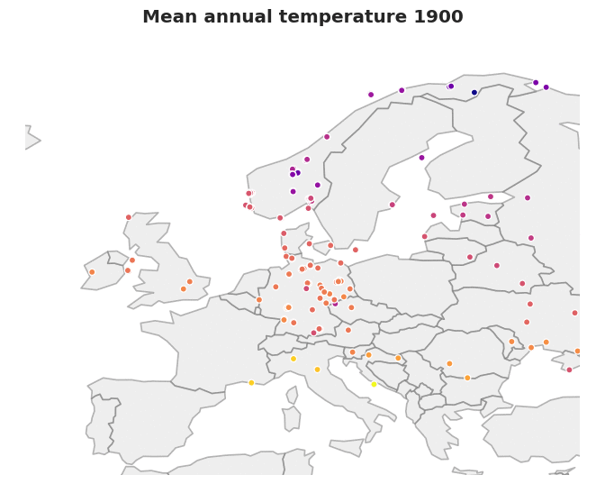

# Plot European weather data.

Publicly available historical weather data from the [European Climate Assessment & Dataset project](https://www.ecad.eu/) is committed to an SQL database. Plots can be created from the SQL database. The piping of data is done by means of Python scripts.

## Data

The ECAD dataset is quite large. The dataset used here contains daily records of
* maximum temperature
* minimum temperature
* mean temperature
* precipitation amount
* mean sea level pressure
* cloud cover
* humidity
* snow depth
* sunshine duration
* global radiation
* mean wind speed
* maximum wind gust
* wind direction

For some weather stations, the records start as early as in the mid 1800s. The availability of weather parameter records differs between stations. For mean temperature, for instance, there is data from 5505 weather stations. In total, there are 1,211,411,278 measurements pertaining to the above parameters.

## Processing

The [data](https://www.ecad.eu//dailydata/predefinedseries.php) are provided in CSV format. For efficient access to the data, all 1,211,411,278 records are committed to an SQL database. Visualisation are created using [Matplotlib](https://matplotlib.org/) and [seaborn](https://seaborn.pydata.org/).

## Reference

Klein Tank, A.M.G. and Coauthors, 2002. Daily dataset of 20th-century surface air temperature and precipitation series for the European Climate Assessment. *Int. J. of Climatol.*, 22, 1441-1453.

Data and metadata available at http://www.ecad.eu
